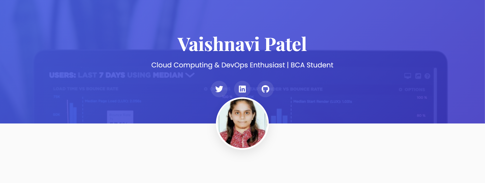
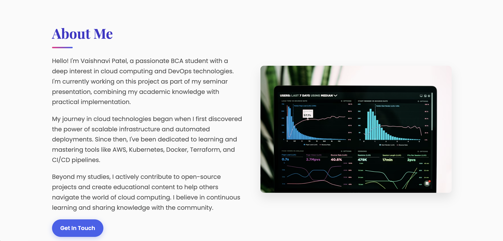

# Terraform Seminar Project

## Overview

This project was developed as part of my BCA seminar on **Terraform**. Terraform is an open-source Infrastructure as Code (IaC) tool used to automate the provisioning and management of cloud infrastructure. This project includes a demo website, Terraform configuration files, project documentation, and presentation.

## Project Contents

* HTML Demo Website
* Terraform Configuration Files
* Project Documentation (PDF)
* PowerPoint Presentation (PPT)

## Topics Covered

* Introduction to Terraform
* Infrastructure as Code (IaC)
* Terraform Architecture
* Providers and Resources
* Terraform Workflow
* State Management
* Cloud Infrastructure Automation

## Project Screenshots

### Home Page

### About Page

## Technologies Used

* HTML
* CSS
* JavaScript
* Terraform

## Conclusion

Terraform simplifies infrastructure deployment and management through automation, consistency, and scalability. This seminar project demonstrates the fundamental concepts and practical applications of Terraform in modern cloud environments.

